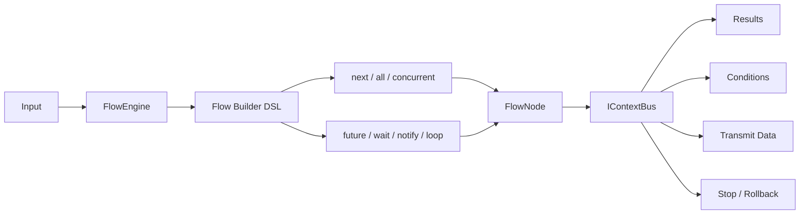

# Salt Function Flow

> Lightweight, in-memory flow orchestration for Spring Boot.

[](https://central.sonatype.com/artifact/io.github.flower-trees/salt-function-flow)
[](./LICENSE)
[](https://spring.io/projects/spring-boot)
[](https://github.com/flower-trees/salt-function-flow)

[中文文档](./README_CN.md) · [Release Notes](./docs/release/pr-1.1.6.md)

Salt Function Flow turns business logic into composable function nodes. With a fluent DSL, you can build linear flows, conditional branches, parallel gateways, async tasks, loops, and sub-flows without introducing a heavyweight workflow platform.

## Why This Project

- Lightweight runtime with in-memory execution and minimal ceremony
- Fluent builder API for readable orchestration
- Flexible node declaration: class, node id, instance, lambda, and sub-flow
- Built-in gateway models: `next`, `all`, `concurrent`, `future`, `wait`, `notify`, `loop`
- Unified context bus for data passing, condition evaluation, result lookup, stop, and rollback
- Spring Boot friendly with configurable and isolated thread pools

## Table of Contents

- [Quick Start](#quick-start)
- [Gateway Overview](#gateway-overview)
- [Architecture at a Glance](#architecture-at-a-glance)
- [Core Concepts](#core-concepts)
- [Advanced Usage](#advanced-usage)
- [Examples](#examples)
- [Contributing](#contributing)
- [License](#license)

## Quick Start

### 1. Add dependency

```xml
<dependency>
    <groupId>io.github.flower-trees</groupId>
    <artifactId>salt-function-flow</artifactId>
    <version>1.1.6</version>
</dependency>
```

```groovy
implementation "io.github.flower-trees:salt-function-flow:1.1.6"
```

### 2. Enable configuration

```java
@Import(FlowConfiguration.class)
```

### 3. Define nodes

Using an e-commerce pricing flow as an example — each node handles one step in the pricing pipeline:

```java
@NodeIdentity("service_fee_node")
public class ServiceFeeNode extends FlowNode<Integer, Integer> {
    @Override
    public Integer process(Integer price) {
        return price + 20;
    }
}

@NodeIdentity
public class PricingMemberDiscountNode extends FlowNode<Integer, Integer> {
    @Override
    public Integer process(Integer price) {
        return (int)(price * 0.85);
    }
}

public static Object applyRounding(Object price) {
    return (Integer) price / 10 * 10;
}
```

### 4. Build and run a flow

Nodes can be referenced in multiple ways and mixed freely:

```java
@Autowired
FlowEngine flowEngine;

@Test
public void testPricingFlow() {
    FlowNode<Integer, Integer> taxNode = new FlowNode<>() {
        @Override
        public Integer process(Integer price) {
            return price + (int)(price * 0.06);
        }
    };

    FlowInstance flow = flowEngine.builder()
            .next("service_fee_node")                            // 1. node id       +20 service fee
            .next(PricingMemberDiscountNode.class)               // 2. class         *0.85 member discount
            .next(taxNode)                                       // 3. new instance  +6% tax
            .next(price -> (Integer) price - 1)                  // 4. lambda        -1 adjustment
            .next(Demo::applyRounding)                           // 5. method ref    round down to tens
            .next(flowEngine.builder()                           // 6. nested flow   +5 subsidy
                    .next(price -> (Integer) price + 5)
                    .build())
            .next(Info.c("service_fee_node > 100",               // 7. Info cond     -10 rebate if fee > 100
                    price -> (Integer) price - 10))
            .build();

    Integer result = flowEngine.execute(flow, 200);
    Assert.assertEquals(185, (int) result);
}
```

> [!TIP]
> Use `build()` for local flow instances and `register()` for reusable flows executed by id.

```java
flowEngine.builder().id("pricing_flow")
        .next("service_fee_node")
        .next(PricingMemberDiscountNode.class)
        .register();

Integer result = flowEngine.execute("pricing_flow", 200);
```

## Gateway Overview

| API | Purpose | Typical Scenario |
| --- | --- | --- |
| `next(...)` | Sequential execution or exclusive routing | Main path, switch-like branching |
| `all(...)` | Inclusive sequential execution | Run all matched branches |
| `concurrent(...)` | Parallel fan-out with merged results | Parallel calculations, aggregation |
| `future(...)` | Start async execution | Launch background branch early |
| `wait(...)` | Join async execution | Sync point before next step |
| `notify(...)` | Fire-and-forget async execution | Side effects, notifications |
| `loop(...)` | Repeated execution until condition changes | Retry, iterative processing |

The following e-commerce order flow demonstrates all 7 gateways together ([full example](./src/test/java/org/salt/function/flow/demo/order/OrderGatewayTest.java)):

```java
FlowInstance flow = flowEngine.builder()
        .future(UserProfileNode.class)                                          // future:      load user profile early (async)
        .next(ItemPriceNode.class)                                              // next:        query item price
        .all(                                                                   // all:         apply all matched promotions
                Info.c("basePrice >= 300", PlatformPromotionNode.class),        //   platform promotion -20
                Info.c("basePrice >= 200", ShopPromotionNode.class)             //   shop promotion     -10
        )
        .concurrent(MemberDiscountNode.class, CouponDiscountNode.class)         // concurrent:  calc member & coupon discounts in parallel
        .next(Info.c(map -> ((Map<String, Object>) map).values().stream()       // next:        pick the best (lowest) price
                .filter(v -> v instanceof Integer)
                .mapToInt(v -> (Integer) v).min().orElse(0)
        ).cAlias("discount_price"))
        .wait(UserProfileNode.class)                                            // wait:        join user profile result
        .next(ignored -> (Integer) ContextBus.get().getResult("discount_price") // next:       best price + profile adjustment
                + (Integer) ((Map) ignored).get(UserProfileNode.class.getName()))
        .next(TaxNode.class)                                                    // next:        add tax
        .loop(i -> (Integer) ContextBus.get().getPreResult() < 0,              // loop:        retry inventory lock if failed
                LockInventoryNode.class)
        .next(OrderCreateNode.class)                                            // next:        create order
        .notify(NotifyNode.class)                                               // notify:      async SMS, non-blocking
        .build();
```

## Architecture at a Glance



## Core Concepts

### `FlowNode<O, I>`

The basic execution unit. Extend `FlowNode` and implement `process(I input)`.

- `I` is the node input type
- `O` is the node output type
- Override `rollback()` only when compensation is needed

### `@NodeIdentity`

Registers a node as a Spring component and gives it a node id. If no id is specified, `getClass().getName()` is used as the default.

```java
@NodeIdentity("custom_node")          // explicit id, referenced as "custom_node"
public class CustomNode extends FlowNode<String, String> {
    @Override
    public String process(String input) {
        return input + "-done";
    }
}

@NodeIdentity                          // no id: defaults to the fully-qualified class name
public class AnotherNode extends FlowNode<String, String> {
    @Override
    public String process(String input) {
        return input + "-another";
    }
}
```

### `FlowEngine`

The main entry point for building, registering, and executing flows.

### `FlowInstance`

An executable flow assembled at runtime. It can be anonymous via `build()` or globally reusable via `register()`.

### `Info`

A wrapper used to add conditions, aliases, and input/output adaptation during orchestration.

### `IContextBus`

The runtime context shared across nodes.

- `getFlowParam()`
- `getPreResult()`
- `getResult(String)` / `getResult(Class<?>)`
- `putTransmit()` / `getTransmit()`
- `addCondition()`
- `stopProcess()`
- `rollbackProcess()`

## Advanced Usage

<details>
<summary>Conditional routing</summary>

Using an e-commerce order as an example — routing to different discount nodes based on VIP status. Three styles are supported:

**1. String expression**

Variables in the expression can come from two sources:
- **Flow parameter fields** (`getFlowParam()`): the framework automatically expands object fields as condition variables, e.g. `order.vip` can be written as just `vip`
- **Condition map passed at execution time** via `execute(flow, param, conditionMap)`

```java
// "vip" comes from the condition map passed at execution time
Order order = Order.builder().vip(true).basePrice(500).build();

FlowInstance flow = flowEngine.builder()
        .next(ItemPriceNode.class)                           // returns Integer price, passed as input to next node
        .next(
                Info.c("vip == true", MemberDiscountNode.class),   // VIP: 15% off
                Info.c("vip == false", CouponDiscountNode.class)   // non-VIP: -30
        )
        .next(TaxNode.class)
        .next(OrderCreateNode.class)
        .build();

flowEngine.execute(flow, order, Map.of("vip", true));
```

**2. Function condition** (reads runtime context directly, no condition map needed)

```java
FlowInstance flow = flowEngine.builder()
        .next(ItemPriceNode.class)
        .next(
                Info.c(bus -> ((Order) ContextBus.get().getFlowParam()).isVip(), MemberDiscountNode.class),
                Info.c(bus -> !((Order) ContextBus.get().getFlowParam()).isVip(), CouponDiscountNode.class)
        )
        .next(TaxNode.class)
        .next(OrderCreateNode.class)
        .build();

flowEngine.execute(flow, order);
```

**3. Add condition dynamically inside a node**

A node can inject condition variables at runtime for downstream expression conditions:

```java
@NodeIdentity
public class ItemPriceNode extends FlowNode<Integer, Order> {
    @Override
    public Integer process(Order order) {
        getContextBus().addCondition("vip", order.isVip());  // injected here, usable as "vip" downstream
        return order.getBasePrice();
    }
}
```

**4. Node return value auto-injected as conditions**

When a node returns a `Map`, the framework automatically adds all key-value pairs into the condition context. Downstream expressions can reference them directly:

```java
@NodeIdentity
public class ItemPriceWithTagNode extends FlowNode<Map<String, Object>, Order> {
    @Override
    public Map<String, Object> process(Order order) {
        return Map.of(
                "price", order.getBasePrice(),
                "vip", order.isVip()
        );
    }
}

FlowInstance flow = flowEngine.builder()
        .next(ItemPriceWithTagNode.class)       // returns Map{"price":500, "vip":true}, auto-injected into condition context
        .next(
                Info.c("vip == true", MemberDiscountNode.class)    // "vip" comes from the previous node's return value
                        .cInput(map -> ((Map) map).get("price")),
                Info.c("vip == false", CouponDiscountNode.class)
                        .cInput(map -> ((Map) map).get("price"))
        )
        .next(TaxNode.class)
        .next(OrderCreateNode.class)
        .build();
```

</details>

<details>
<summary>Input and output adaptation</summary>

Use `Info.cInput(...)` and `Info.cOutput(...)` when node contracts do not match naturally.

```java
FlowInstance flow = flowEngine.builder()
        .next(
                Info.c(AddNode.class)
                        .cInput(input -> (Integer) input + 10)
                        .cOutput(output -> (Integer) output * 2)
        )
        .next(ReduceNode.class)
        .build();
```

</details>

<details>
<summary>Context and result passing</summary>

Read earlier node results or attach custom runtime data through `IContextBus`.

```java
@NodeIdentity
public class ResultNode extends FlowNode<Integer, Integer> {
    @Override
    public Integer process(Integer input) {
        IContextBus bus = getContextBus();
        Integer addResult = bus.getResult(AddNode.class);
        bus.putTransmit("stage", "after-add");
        return addResult == null ? input : addResult;
    }
}
```

</details>

<details>
<summary>Parallel and async orchestration</summary>

```java
FlowInstance flow = flowEngine.builder()
        .next(AddNode.class)
        .concurrent(ReduceNode.class, MultiplyNode.class)
        .next(resultMap -> ((Map<String, Object>) resultMap).values().stream()
                .filter(Integer.class::isInstance)
                .mapToInt(v -> (Integer) v)
                .sum())
        .build();
```

```java
FlowInstance flow = flowEngine.builder()
        .future(ReduceNode.class)
        .next(MultiplyNode.class)
        .wait(ReduceNode.class)
        .build();
```

</details>

<details>
<summary>Sub-flow composition</summary>

Sub-flows can be composed exactly like nodes.

```java
FlowInstance branchA = flowEngine.builder()
        .next(ReduceNode.class)
        .build();

FlowInstance branchB = flowEngine.builder()
        .next(MultiplyNode.class)
        .build();

FlowInstance flow = flowEngine.builder()
        .all(branchA, branchB)
        .build();
```

</details>

<details>
<summary>Stop and rollback</summary>

```java
@NodeIdentity
public class RiskNode extends FlowNode<Integer, Integer> {
    @Override
    public Integer process(Integer input) {
        if (input > 500) {
            getContextBus().rollbackProcess();
        }
        return input;
    }

    @Override
    public void rollback() {
        System.out.println("RiskNode rollback executed");
    }
}
```

</details>

<details>
<summary>Thread pool and timeout</summary>

The framework provides a default `flowThreadPool` and supports per-gateway isolation.

```yaml
salt:
  function:
    flow:
      threadpool:
        coreSize: 50
        maxSize: 150
        queueCapacity: 256
        keepAlive: 30
```

```java
ExecutorService isolatePool = Executors.newFixedThreadPool(3);

FlowInstance flow = flowEngine.builder()
        .concurrent(isolatePool, 1000L, ReduceNode.class, MultiplyNode.class)
        .build();
```

</details>

## Examples

- [7 node reference styles](./src/test/java/org/salt/function/flow/demo/order/NodeStyleTest.java): id / class / new instance / lambda / method reference / nested flow / Info condition
- [All-gateway example](./src/test/java/org/salt/function/flow/demo/order/OrderGatewayTest.java): future / next / all / concurrent / wait / loop / notify — all 7 gateways in one order flow
- [Concurrent discount + async notify](./src/test/java/org/salt/function/flow/demo/order/OrderConcurrentTest.java): concurrent fan-out for best discount, notify for async SMS
- [Conditional routing + rollback](./src/test/java/org/salt/function/flow/demo/order/OrderConditionTest.java): VIP/non-VIP exclusive routing, inventory deduct with rollback
- [Builder example](./src/test/java/org/salt/function/flow/example/FlowBuildExample.java): demonstrates 7 node reference styles
- [Gateway and sub-flow examples](./src/test/java/org/salt/function/flow/demo/math/DemoFlowInit.java): covers all gateway types
- [Conditional ticketing example](./src/test/java/org/salt/function/flow/demo/train/TrainFlowInit.java): conditional routing and parameter adaptation

## Contributing

Issues and pull requests are welcome.

If you plan to contribute:

- keep nodes focused and single-purpose
- prefer explicit flow ids for reusable flows
- use aliases when the same node appears multiple times in one flow
- add rollback logic only for compensatable operations

## License

Apache License 2.0. See [`LICENSE`](./LICENSE).
