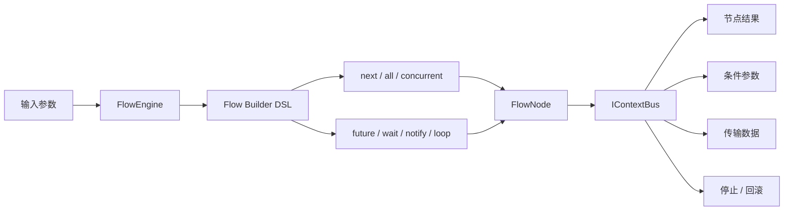

# Salt Function Flow

> 面向 Spring Boot 的轻量级内存流编排引擎。

[](https://central.sonatype.com/artifact/io.github.flower-trees/salt-function-flow)
[](./LICENSE)
[](https://spring.io/projects/spring-boot)
[](https://github.com/flower-trees/salt-function-flow)

[English](./README.md) · [发布说明](./docs/release/pr-1.1.6-cn.md)

Salt Function Flow 将业务逻辑拆分为可组合的函数节点，并通过统一 DSL 完成顺序执行、条件路由、并行网关、异步任务、循环控制与子流程编排，适合在不引入重量级工作流平台的前提下，快速搭建清晰、可维护的业务流程。

## 为什么选择它

- 轻量内存执行，运行开销低，接入成本小
- Builder 风格 DSL，流程编排可读性强
- 节点声明灵活，支持类、节点 ID、实例、Lambda、子流程
- 内置多种网关模型：`next`、`all`、`concurrent`、`future`、`wait`、`notify`、`loop`
- 统一 `IContextBus`，支持上下文透传、条件参数、结果回读、停止和回滚
- 友好集成 Spring Boot，支持全局线程池与隔离线程池

## 目录

- [快速开始](#快速开始)
- [网关能力总览](#网关能力总览)
- [架构速览](#架构速览)
- [核心概念](#核心概念)
- [高级用法](#高级用法)
- [示例入口](#示例入口)
- [参与贡献](#参与贡献)
- [License](#license)

## 快速开始

### 1. 引入依赖

```xml
<dependency>
    <groupId>io.github.flower-trees</groupId>
    <artifactId>salt-function-flow</artifactId>
    <version>1.1.6</version>
</dependency>
```

```groovy
implementation "io.github.flower-trees:salt-function-flow:1.1.6"
```

### 2. 启用配置

```java
@Import(FlowConfiguration.class)
```

### 3. 定义节点

以电商定价为例，每个节点负责定价流程中的一个环节：

```java
@NodeIdentity("service_fee_node")
public class ServiceFeeNode extends FlowNode<Integer, Integer> {
    @Override
    public Integer process(Integer price) {
        return price + 20;
    }
}

@NodeIdentity
public class PricingMemberDiscountNode extends FlowNode<Integer, Integer> {
    @Override
    public Integer process(Integer price) {
        return (int)(price * 0.85);
    }
}

public static Object applyRounding(Object price) {
    return (Integer) price / 10 * 10;
}
```

### 4. 编排并执行流程

节点支持多种引用方式，可以混合使用：

```java
@Autowired
FlowEngine flowEngine;

@Test
public void testPricingFlow() {
    FlowNode<Integer, Integer> taxNode = new FlowNode<>() {
        @Override
        public Integer process(Integer price) {
            return price + (int)(price * 0.06);
        }
    };

    FlowInstance flow = flowEngine.builder()
            .next("service_fee_node")                            // 1. node id       +20 服务费
            .next(PricingMemberDiscountNode.class)               // 2. class         *0.85 会员折扣
            .next(taxNode)                                       // 3. new 实例      +6% 税
            .next(price -> (Integer) price - 1)                  // 4. lambda        -1 调整
            .next(Demo::applyRounding)                           // 5. 方法引用      取整到十位
            .next(flowEngine.builder()                           // 6. 子流程        +5 补贴
                    .next(price -> (Integer) price + 5)
                    .build())
            .next(Info.c("service_fee_node > 100",               // 7. Info 条件     满减 -10
                    price -> (Integer) price - 10))
            .build();

    Integer result = flowEngine.execute(flow, 200);
    Assert.assertEquals(185, (int) result);
}
```

> [!TIP]
> `build()` 适合局部匿名流程，`register()` 适合注册可复用的全局流程。

```java
flowEngine.builder().id("pricing_flow")
        .next("service_fee_node")
        .next(PricingMemberDiscountNode.class)
        .register();

Integer result = flowEngine.execute("pricing_flow", 200);
```

## 网关能力总览

| API | 作用 | 典型场景 |
| --- | --- | --- |
| `next(...)` | 顺序执行或排他分支 | 主流程、条件切换 |
| `all(...)` | 相容顺序执行 | 命中多个条件都执行 |
| `concurrent(...)` | 并发执行并聚合结果 | 并行计算、结果汇总 |
| `future(...)` | 提前发起异步分支 | 后台支线提前启动 |
| `wait(...)` | 等待异步分支完成 | 汇合点、同步继续 |
| `notify(...)` | 异步通知，不阻塞主流程 | 通知、埋点、副作用任务 |
| `loop(...)` | 条件循环执行 | 重试、迭代处理 |

以下电商下单流程综合演示了全部 7 种网关（[完整示例](./src/test/java/org/salt/function/flow/demo/order/OrderGatewayTest.java)）：

```java
FlowInstance flow = flowEngine.builder()
        .future(UserProfileNode.class)                                          // future:      提前异步加载用户画像
        .next(ItemPriceNode.class)                                              // next:        查询商品价格
        .all(                                                                   // all:         叠加所有命中的促销
                Info.c("basePrice >= 300", PlatformPromotionNode.class),        //   平台满减 -20
                Info.c("basePrice >= 200", ShopPromotionNode.class)             //   店铺满减 -10
        )
        .concurrent(MemberDiscountNode.class, CouponDiscountNode.class)         // concurrent:  并行计算会员折扣与优惠券折扣
        .next(Info.c(map -> ((Map<String, Object>) map).values().stream()       // next:        取最优折扣
                .filter(v -> v instanceof Integer)
                .mapToInt(v -> (Integer) v).min().orElse(0)
        ).cAlias("discount_price"))
        .wait(UserProfileNode.class)                                            // wait:        等待用户画像结果
        .next(ignored -> (Integer) ContextBus.get().getResult("discount_price") // next:       折扣价 + 画像调整值
                + (Integer) ((Map) ignored).get(UserProfileNode.class.getName()))
        .next(TaxNode.class)                                                    // next:        加税
        .loop(i -> (Integer) ContextBus.get().getPreResult() < 0,              // loop:        锁库存失败则重试
                LockInventoryNode.class)
        .next(OrderCreateNode.class)                                            // next:        创建订单
        .notify(NotifyNode.class)                                               // notify:      异步发短信，不阻塞返回
        .build();
```

## 架构速览



## 核心概念

### `FlowNode<O, I>`

最基础的执行单元，继承 `FlowNode` 并实现 `process(I input)`。

- `I` 表示节点入参类型
- `O` 表示节点返回值类型
- 只有在需要补偿时才重写 `rollback()`

### `@NodeIdentity`

为节点声明 Spring Bean 与节点 ID。不指定 ID 时默认使用 `getClass().getName()`。

```java
@NodeIdentity("custom_node")          // 指定节点 ID，可通过 "custom_node" 引用
public class CustomNode extends FlowNode<String, String> {
    @Override
    public String process(String input) {
        return input + "-done";
    }
}

@NodeIdentity                          // 不指定时默认使用类全限定名作为节点 ID
public class AnotherNode extends FlowNode<String, String> {
    @Override
    public String process(String input) {
        return input + "-another";
    }
}
```

### `FlowEngine`

流程编排、注册与执行的核心入口。

### `FlowInstance`

运行时生成的可执行流程实例。可通过 `build()` 生成匿名实例，也可通过 `register()` 注册为全局流程。

### `Info`

用于在编排时增加条件、别名、入参适配、出参适配等能力。

### `IContextBus`

节点运行时共享的上下文容器。

- `getFlowParam()`
- `getPreResult()`
- `getResult(String)` / `getResult(Class<?>)`
- `putTransmit()` / `getTransmit()`
- `addCondition()`
- `stopProcess()`
- `rollbackProcess()`

## 高级用法

<details>
<summary>条件路由</summary>

以电商下单为例，根据是否 VIP 走不同的折扣节点。条件支持三种写法：

**1. 字符串表达式**

表达式中的变量来源有两种：
- **流程参数**（`getFlowParam()`）：框架会自动将其字段展开为条件变量，如 `order.vip` 可直接写成 `vip`
- **执行时传入的条件 Map**：通过 `execute(flow, param, conditionMap)` 注入

```java
// vip 来自执行时传入的条件 Map
Order order = Order.builder().vip(true).basePrice(500).build();

FlowInstance flow = flowEngine.builder()
        .next(ItemPriceNode.class)                           // 返回 Integer 价格，作为下一节点入参
        .next(
                Info.c("vip == true", MemberDiscountNode.class),   // VIP：85 折
                Info.c("vip == false", CouponDiscountNode.class)   // 非 VIP：减 30 元
        )
        .next(TaxNode.class)
        .next(OrderCreateNode.class)
        .build();

flowEngine.execute(flow, order, Map.of("vip", true));
```

**2. 函数条件**（直接读取运行时上下文，无需传入条件 Map）

```java
FlowInstance flow = flowEngine.builder()
        .next(ItemPriceNode.class)
        .next(
                Info.c(bus -> ((Order) ContextBus.get().getFlowParam()).isVip(), MemberDiscountNode.class),
                Info.c(bus -> !((Order) ContextBus.get().getFlowParam()).isVip(), CouponDiscountNode.class)
        )
        .next(TaxNode.class)
        .next(OrderCreateNode.class)
        .build();

flowEngine.execute(flow, order);
```

**3. 节点内动态追加条件**

节点执行时可向上下文注入条件变量，供后续节点的条件表达式使用：

```java
@NodeIdentity
public class ItemPriceNode extends FlowNode<Integer, Order> {
    @Override
    public Integer process(Order order) {
        getContextBus().addCondition("vip", order.isVip());  // 动态注入，后续节点可直接用 "vip"
        return order.getBasePrice();
    }
}
```

**4. 节点返回值自动注入条件**

当节点返回 `Map` 时，框架默认将其所有 key-value 自动写入条件上下文，下游表达式可直接引用：

```java
@NodeIdentity
public class ItemPriceWithTagNode extends FlowNode<Map<String, Object>, Order> {
    @Override
    public Map<String, Object> process(Order order) {
        return Map.of(
                "price", order.getBasePrice(),
                "vip", order.isVip()
        );
    }
}

FlowInstance flow = flowEngine.builder()
        .next(ItemPriceWithTagNode.class)       // 返回 Map{"price":500, "vip":true}，自动注入条件上下文
        .next(
                Info.c("vip == true", MemberDiscountNode.class)    // "vip" 直接来自上一节点返回值
                        .cInput(map -> ((Map) map).get("price")),
                Info.c("vip == false", CouponDiscountNode.class)
                        .cInput(map -> ((Map) map).get("price"))
        )
        .next(TaxNode.class)
        .next(OrderCreateNode.class)
        .build();
```

</details>

<details>
<summary>入参和出参适配</summary>

当上下游节点类型不自然匹配时，可通过 `Info.cInput(...)` 与 `Info.cOutput(...)` 做适配。

```java
FlowInstance flow = flowEngine.builder()
        .next(
                Info.c(AddNode.class)
                        .cInput(input -> (Integer) input + 10)
                        .cOutput(output -> (Integer) output * 2)
        )
        .next(ReduceNode.class)
        .build();
```

</details>

<details>
<summary>上下文和结果透传</summary>

通过 `IContextBus` 读取历史节点结果，或者透传自定义运行时数据。

```java
@NodeIdentity
public class ResultNode extends FlowNode<Integer, Integer> {
    @Override
    public Integer process(Integer input) {
        IContextBus bus = getContextBus();
        Integer addResult = bus.getResult(AddNode.class);
        bus.putTransmit("stage", "after-add");
        return addResult == null ? input : addResult;
    }
}
```

</details>

<details>
<summary>并发和异步编排</summary>

```java
FlowInstance flow = flowEngine.builder()
        .next(AddNode.class)
        .concurrent(ReduceNode.class, MultiplyNode.class)
        .next(resultMap -> ((Map<String, Object>) resultMap).values().stream()
                .filter(Integer.class::isInstance)
                .mapToInt(v -> (Integer) v)
                .sum())
        .build();
```

```java
FlowInstance flow = flowEngine.builder()
        .future(ReduceNode.class)
        .next(MultiplyNode.class)
        .wait(ReduceNode.class)
        .build();
```

</details>

<details>
<summary>子流程编排</summary>

子流程可以像普通节点一样参与编排。

```java
FlowInstance branchA = flowEngine.builder()
        .next(ReduceNode.class)
        .build();

FlowInstance branchB = flowEngine.builder()
        .next(MultiplyNode.class)
        .build();

FlowInstance flow = flowEngine.builder()
        .all(branchA, branchB)
        .build();
```

</details>

<details>
<summary>停止和回滚</summary>

```java
@NodeIdentity
public class RiskNode extends FlowNode<Integer, Integer> {
    @Override
    public Integer process(Integer input) {
        if (input > 500) {
            getContextBus().rollbackProcess();
        }
        return input;
    }

    @Override
    public void rollback() {
        System.out.println("RiskNode rollback executed");
    }
}
```

</details>

<details>
<summary>线程池和超时</summary>

框架默认提供 `flowThreadPool`，同时支持按网关隔离线程池。

```yaml
salt:
  function:
    flow:
      threadpool:
        coreSize: 50
        maxSize: 150
        queueCapacity: 256
        keepAlive: 30
```

```java
ExecutorService isolatePool = Executors.newFixedThreadPool(3);

FlowInstance flow = flowEngine.builder()
        .concurrent(isolatePool, 1000L, ReduceNode.class, MultiplyNode.class)
        .build();
```

</details>

## 示例入口

- [7种节点引用方式](./src/test/java/org/salt/function/flow/demo/order/NodeStyleTest.java)：id / class / new 实例 / lambda / 方法引用 / 子流程 / Info 条件
- [全网关综合示例](./src/test/java/org/salt/function/flow/demo/order/OrderGatewayTest.java)：future/next/all/concurrent/wait/loop/notify 7种网关在一条下单流程中的完整演示
- [并发折扣 + 异步通知](./src/test/java/org/salt/function/flow/demo/order/OrderConcurrentTest.java)：concurrent 聚合最优折扣，notify 异步发短信
- [条件分支 + 回滚补偿](./src/test/java/org/salt/function/flow/demo/order/OrderConditionTest.java)：VIP/非VIP 排他路由，库存扣减支持 rollback
- [基础 Builder 示例](./src/test/java/org/salt/function/flow/example/FlowBuildExample.java)：演示 7 种节点引用方式
- [网关与子流程示例](./src/test/java/org/salt/function/flow/demo/math/DemoFlowInit.java)：覆盖所有网关类型
- [车票条件分支示例](./src/test/java/org/salt/function/flow/demo/train/TrainFlowInit.java)：条件路由与参数适配

## 参与贡献

欢迎提交 Issue 和 Pull Request。

如果你准备贡献代码，建议优先遵循这些原则：

- 节点尽量保持单一职责
- 可复用流程优先显式指定 flow id
- 同一节点在同一流程多次出现时优先加别名
- 只有可补偿动作才实现 `rollback()`

## License

Apache License 2.0。详见 [`LICENSE`](./LICENSE)。
